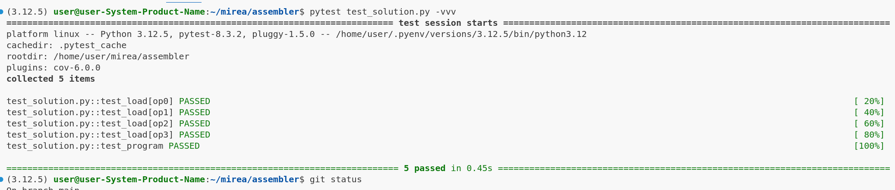
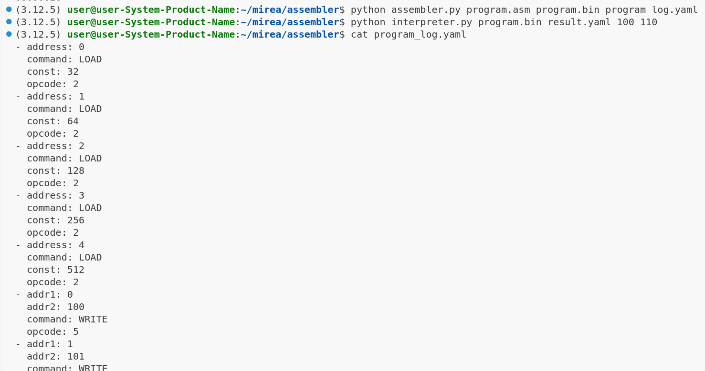
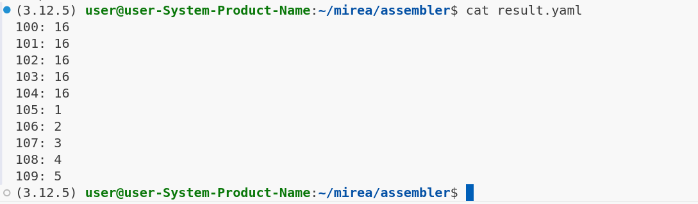
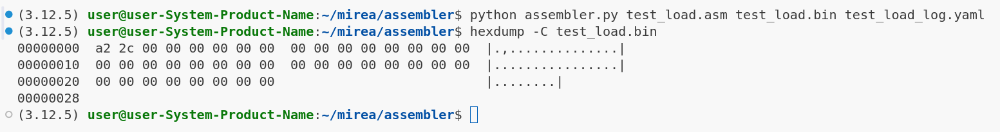
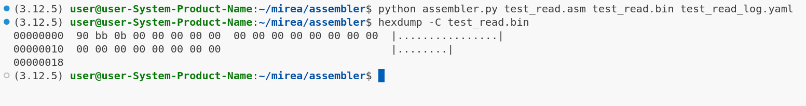
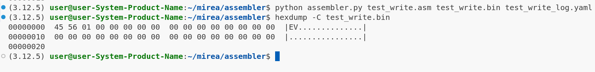
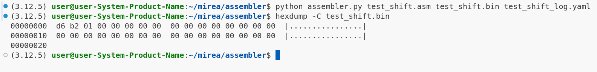

## Assembler

### Описание главного теста

Есть 2 массива чисел $A = \{32, 64, 128, 256, 512\}$, $B = \{1, 2, 3, 4, 5\}$, хранящиеся
подряд в ячейках памяти с номерами с 100 по 110. К массиву $A$ применяется операция
$A[i] = A[i] >> B[i]$. Конечное ожидаемое состояние массивов:
$A = \{16, 16, 16, 16, 16\}$, $B = \{1, 2, 3, 4, 5\}$


### Pytest

```pytest test_solution.py -vvv```



### Запуск главного теста и результаты

```python assembler.py program.asm program.bin program_log.yaml```

```python interpreter.py program.bin result.yaml 100 110```




## Тесты на получаемую последовательность байт операций LOAD READ WRITE SHIFT

Можно убедиться, что полученные значения совпадают с указанными в условии задачи








